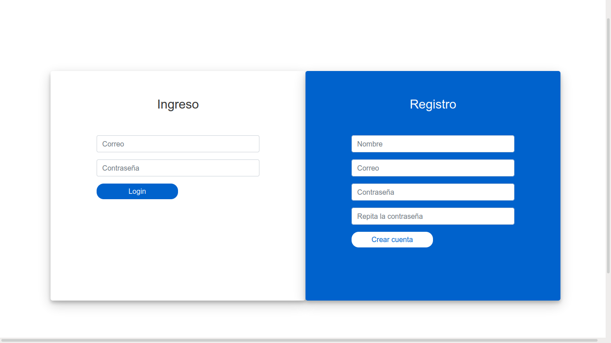
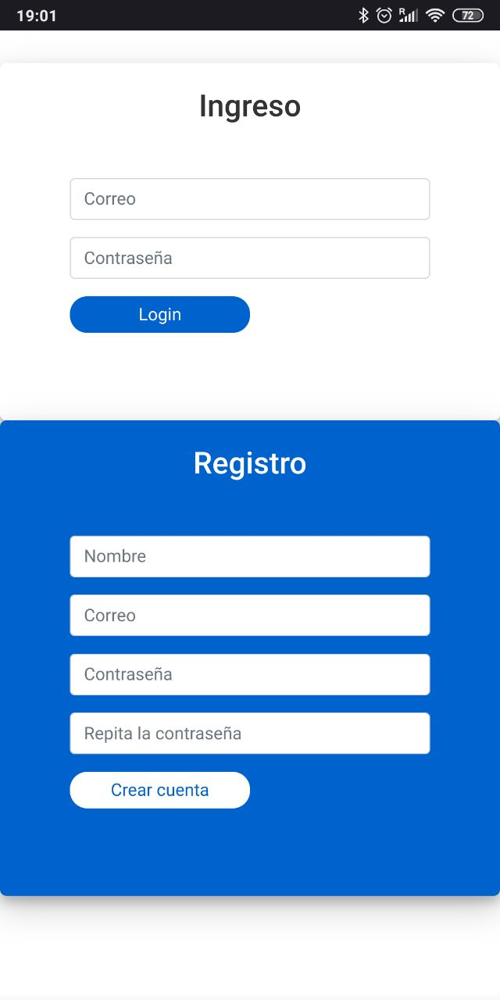
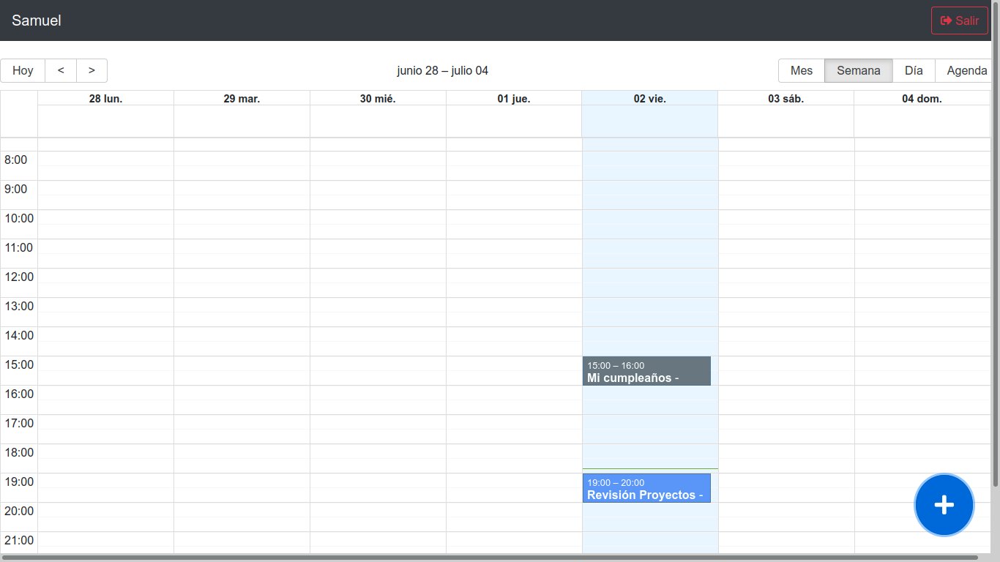
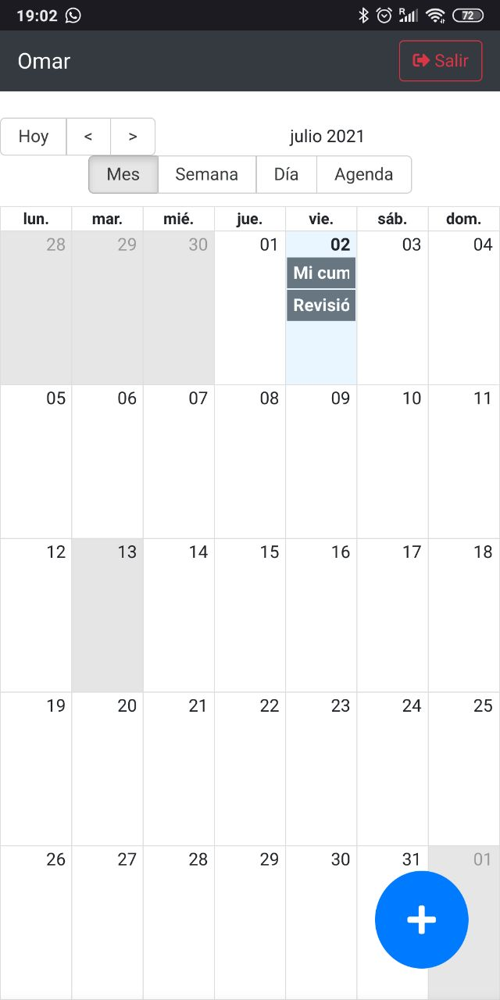
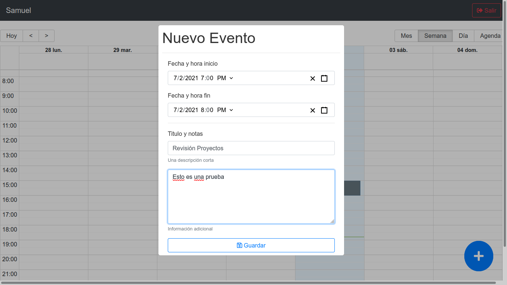
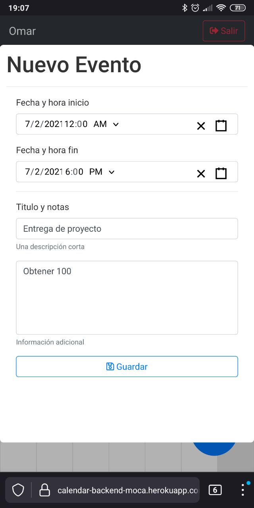
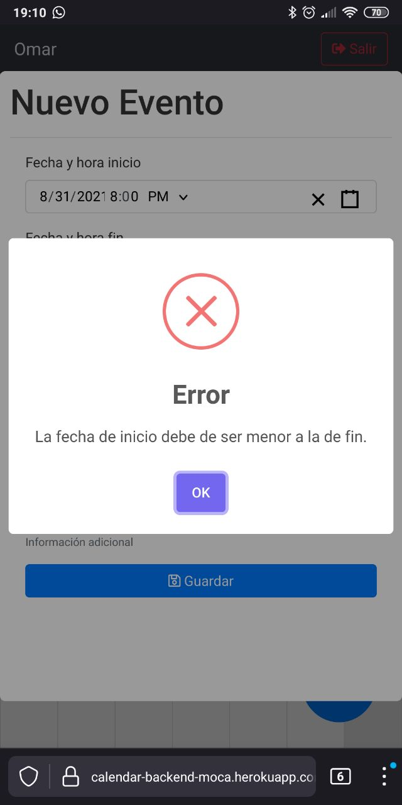
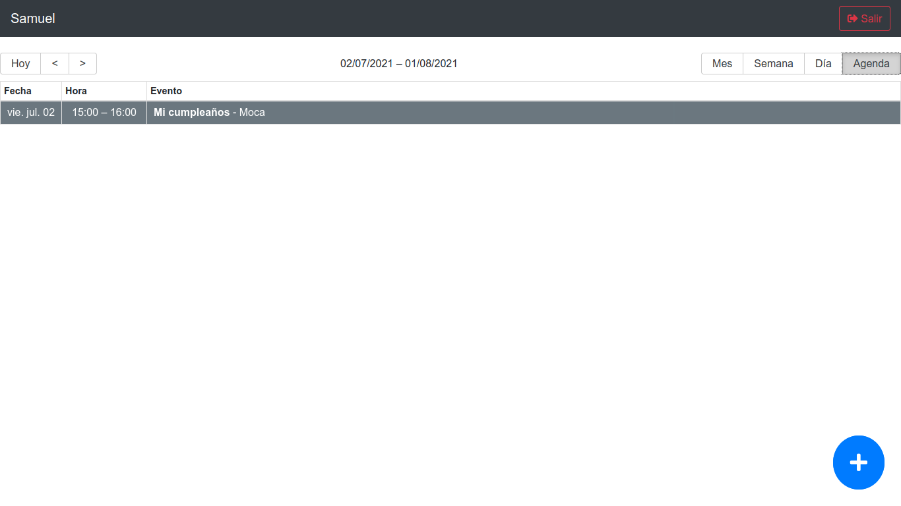
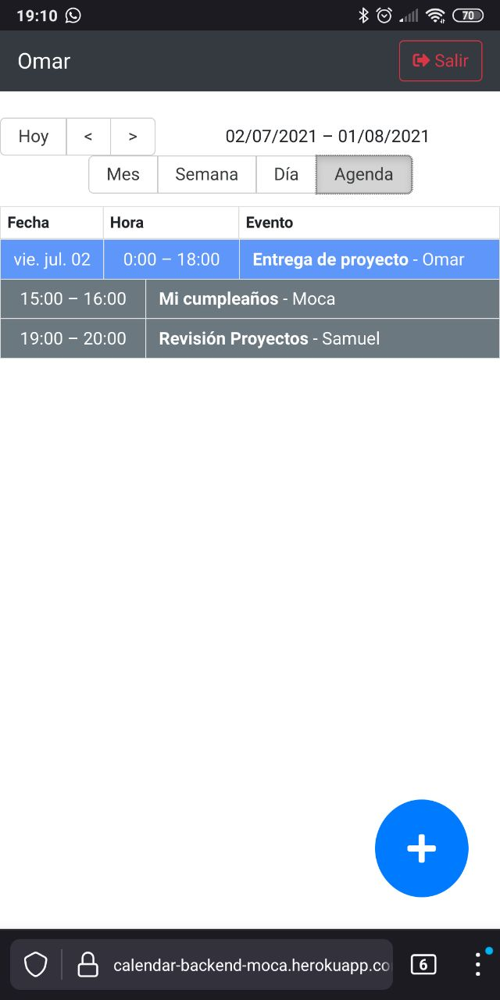

# CalendarApp

___
## Desplegada en [CalendarApp](https://calendar-backend-moca.herokuapp.com)

___ 

### Objetivo

La idea de esta aplicación es que todo un equipo de trabajo dedicado a un proyecto, **por ejemplo un equipo de desarrollo**, tenga un **calendario personalizado compartido** en el cual todos los integrantes de dicho equipo puedan:

- ***Crear eventos***
  
   De tal manera que se pueda tener una **vista general** de que cuales son los eventos que están por venir y que pueden ser relevantes para todo el equipo, como lo podría ser una fecha de entrega, o simplemente tener una idea de en que se encuentra trabajando cada uno de los integrantes del equipo, e inclusive podrían ser eventos pasados de los cuales es impoartante **mantener un registro** ya que dichos eventos pueden ser creados en cualquier fecha, siempre y cuando su fecha de fin sea mayor a la fecha de inio.  

   Los eventos creados por quien inicia sesión son **distingibles** de los **creados por otros integrantes** del equipo gracias al color con el que son dibujados en pantalla.

### Integrantes

> Carlos Beltran 

### Instrucciones de instalación

En caso de que se desee usar de manera local este proyecto es necesario clonar este repositorio (frontend) como el de [calendar-back](https://github.com/omar2959/calendar-back) en sus respectivas carpetas y de manera independiente.

#### Para ambas carpetas (frontend y backend)
Y desde la terminal ejecutar los siguientes comandos:
>`$ npm install`

Lo que instalara todas las dependencias del proyecto

#### Dentro de la carpeta de frontend
>`$ npm start`

Para iniciar el proyecto en ***localhost:3000***

#### Dentro de la carpeta de ***backend***
>`$ npm run dev`

Para correr el servidor de express en ***localhost:4000***

___

### Screenshots

####***Login &  Registro***

| Escritorio | Móvil |
|------ | ----- |
|  | 

####***Calendar Screen***
| Escritorio | Móvil |
|------ | ----- |
|  | 

####***Nuevo Evento***
| Escritorio | Móvil |
|------ | ----- |
|  | 

####***Edición de Evento***
| Escritorio | Móvil |
|------ | ----- |
|  | 

####***Agenda***
| Escritorio | Móvil |
|------ | ----- |
|  | 